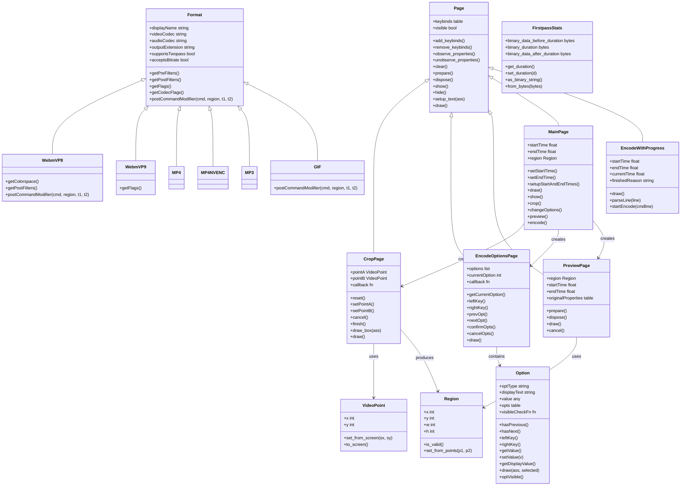

# Class Diagram (Mermaid)

```mermaid
classDiagram
    class Page {
        +keybinds table
        +visible bool
        +add_keybinds()
        +remove_keybinds()
        +observe_properties()
        +unobserve_properties()
        +clear()
        +prepare()
        +dispose()
        +show()
        +hide()
        +setup_text(ass)
        +draw()
    }

    class CropPage {
        +pointA VideoPoint
        +pointB VideoPoint
        +callback fn
        +reset()
        +setPointA()
        +setPointB()
        +cancel()
        +finish()
        +draw_box(ass)
        +draw()
    }

    class EncodeOptionsPage {
        +options list
        +currentOption int
        +callback fn
        +getCurrentOption()
        +leftKey()
        +rightKey()
        +prevOpt()
        +nextOpt()
        +confirmOpts()
        +cancelOpts()
        +draw()
    }

    class PreviewPage {
        +region Region
        +startTime float
        +endTime float
        +originalProperties table
        +prepare()
        +dispose()
        +draw()
        +cancel()
    }

    class MainPage {
        +startTime float
        +endTime float
        +region Region
        +setStartTime()
        +setEndTime()
        +setupStartAndEndTimes()
        +draw()
        +show()
        +crop()
        +changeOptions()
        +preview()
        +encode()
    }

    class Format {
        +displayName string
        +videoCodec string
        +audioCodec string
        +outputExtension string
        +supportsTwopass bool
        +acceptsBitrate bool
        +getPreFilters()
        +getPostFilters()
        +getFlags()
        +getCodecFlags()
        +postCommandModifier(cmd, region, t1, t2)
    }

    class WebmVP8 {
        +getColorspace()
        +getPostFilters()
        +postCommandModifier(cmd, region, t1, t2)
    }

    class WebmVP9 {
        +getFlags()
    }

    class MP4 { }
    class MP4NVENC { }
    class MP3 { }

    class GIF {
        +postCommandModifier(cmd, region, t1, t2)
    }

    class VideoPoint {
        +x int
        +y int
        +set_from_screen(sx, sy)
        +to_screen()
    }

    class Region {
        +x int
        +y int
        +w int
        +h int
        +is_valid()
        +set_from_points(p1, p2)
    }

    class FirstpassStats {
        +binary_data_before_duration bytes
        +binary_duration bytes
        +binary_data_after_duration bytes
        +get_duration()
        +set_duration(d)
        +as_binary_string()
        +from_bytes(bytes)
    }

    class Option {
        +optType string
        +displayText string
        +value any
        +opts table
        +visibleCheckFn fn
        +hasPrevious()
        +hasNext()
        +leftKey()
        +rightKey()
        +getValue()
        +setValue(v)
        +getDisplayValue()
        +draw(ass, selected)
        +optVisible()
    }

    class EncodeWithProgress {
        +startTime float
        +endTime float
        +currentTime float
        +finishedReason string
        +draw()
        +parseLine(line)
        +startEncode(cmdline)
    }

    Page <|-- CropPage
    Page <|-- EncodeOptionsPage
    Page <|-- PreviewPage
    Page <|-- MainPage
    Page <|-- EncodeWithProgress

    Format <|-- WebmVP8
    Format <|-- WebmVP9
    Format <|-- MP4
    Format <|-- MP4NVENC
    Format <|-- MP3
    Format <|-- GIF

    CropPage --> VideoPoint : uses
    CropPage --> Region : produces
    MainPage --> CropPage : creates
    MainPage --> EncodeOptionsPage : creates
    MainPage --> PreviewPage : creates
    PreviewPage --> Region : uses
    EncodeOptionsPage --> Option : contains
```
