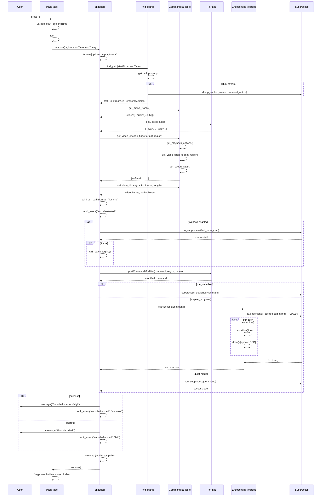

# Encode Sequence Diagram (Mermaid)

```mermaid
sequenceDiagram
    participant U as User
    participant MP as MainPage
    participant ENC as encode()
    participant FP as find_path()
    participant CB as Command Builders
    participant FMT as Format
    participant EWP as EncodeWithProgress
    participant SYS as Subprocess

    U->>MP: press 'e'
    MP->>MP: validate startTime/endTime
    MP->>MP: hide()
    MP->>ENC: encode(region, startTime, endTime)

    ENC->>ENC: formats[options.output_format]
    ENC->>FP: find_path(startTime, endTime)
    FP->>FP: get path property
    alt HLS stream
        FP->>SYS: dump_cache (via mp.command_native)
    end
    FP-->>ENC: path, is_stream, is_temporary, times

    ENC->>CB: get_active_tracks()
    CB-->>ENC: {video:[], audio:[], sub:[]}

    ENC->>FMT: getCodecFlags()
    FMT-->>ENC: [--ovc=..., --oac=...]

    ENC->>CB: get_video_encode_flags(format, region)
    CB->>CB: get_playback_options()
    CB->>CB: get_video_filters(format, region)
    CB->>CB: get_speed_flags()
    CB-->>ENC: [--vf-add=..., ...]

    ENC->>CB: calculate_bitrate(tracks, format, length)
    CB-->>ENC: video_bitrate, audio_bitrate

    ENC->>ENC: build out_path (format_filename)
    ENC->>ENC: emit_event("encode-started")

    alt twopass enabled
        ENC->>SYS: run_subprocess(first_pass_cmd)
        SYS-->>ENC: success/fail
        alt libvpx
            ENC->>ENC: vp8_patch_logfile()
        end
    end

    ENC->>FMT: postCommandModifier(command, region, times)
    FMT-->>ENC: modified command

    alt run_detached
        ENC->>SYS: subprocess_detached(command)
    else display_progress
        ENC->>EWP: startEncode(command)
        EWP->>SYS: io.popen(shell_escape(command) + " 2>&1")
        loop for each stderr line
            EWP->>EWP: parseLine(line)
            EWP->>EWP: draw() [update OSD]
        end
        SYS-->>EWP: fd:close()
        EWP-->>ENC: success bool
    else quiet mode
        ENC->>SYS: run_subprocess(command)
        SYS-->>ENC: success bool
    end

    alt success
        ENC->>U: message("Encoded successfully!")
        ENC->>ENC: emit_event("encode-finished", "success")
    else failure
        ENC->>U: message("Encode failed!")
        ENC->>ENC: emit_event("encode-finished", "fail")
    end

    ENC->>ENC: cleanup (logfile, temp file)
    ENC-->>MP: (returns)
    MP->>MP: (page was hidden, stays hidden)
```
